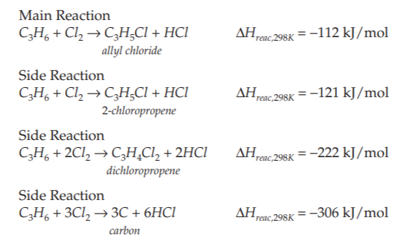
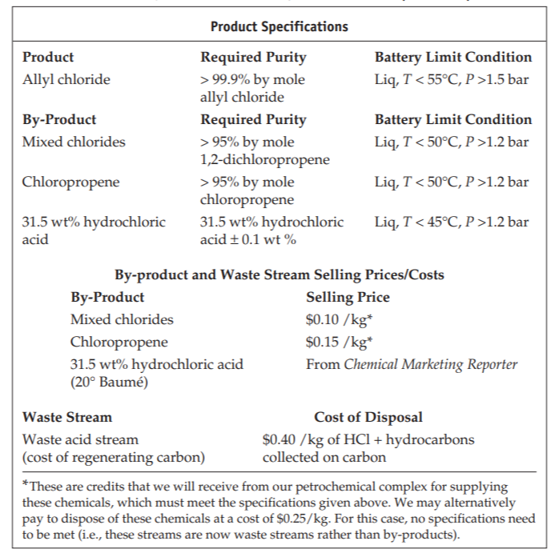

We are tasked with designing and optimizing a plant for the production of 3-chloro-1-propene (allyl chloride) through the thermal chlorination of propylene at high temperature and moderate pressure in a fluidized bed reactor. The reactions involved are as follws:  
  
The targeted plant production is 20,000 metric ton per year and the product specifications are as follows:  
  
The plant will be comprised of three major sections: the reactor section, the separation section and several refrigeration sections. The reactor section includeds feed heating preparation, the fluidized bed reactor, a cooling cycle for the reactor and cooling preparation for separation. The separation section includes towers that each separates hydrogen chloride, propylene, chloropropene by-product, mixed chlorides by-product, and allyl chloride, each complete with reflux drums, reflux pumps and reboilers. 
